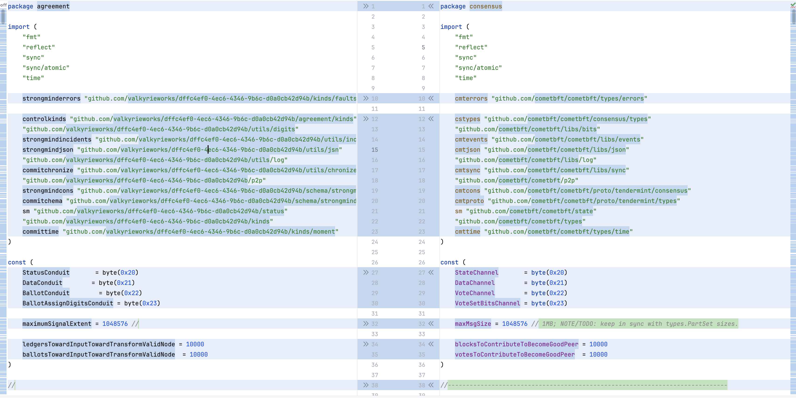
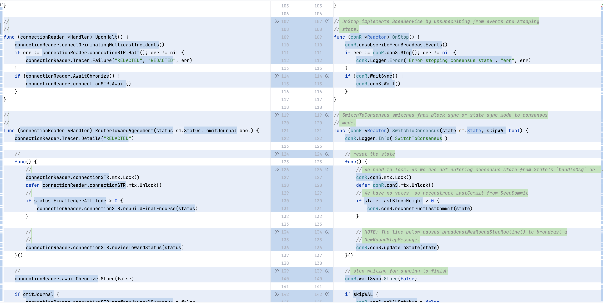
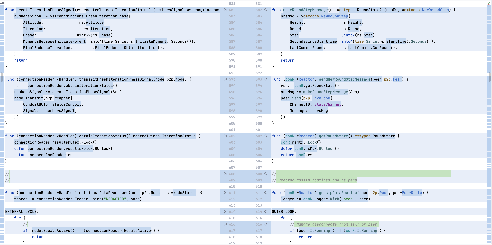

# cometbft | Valkyrie Anonymization Sample

### **Source Metadata**

* **Original Project:** `https://github.com/cometbft/cometbft`
* **Source Commit:** `00271936093e1af7369a02e32a89e57dbb8882d4`
* **Total Lines of Code**  `158373`
* **Duration** `261.74s`  
* **Tokens In / Out**  `90134 / 31957`
---

### **The Transformation **
**Side-by-Side** comparison of anonymized [agreement/handler.go](agreement/handler.go) to original [consensus/reactor.go](https://github.com/cometbft/cometbft/blob/456b00aca9a44e395095fcbb757caf863e9f8dc0/consensus/reactor.go) 

---

### **About Valkyrie**

Valkyrie is the **Human Consensus Protocol for software verification**
